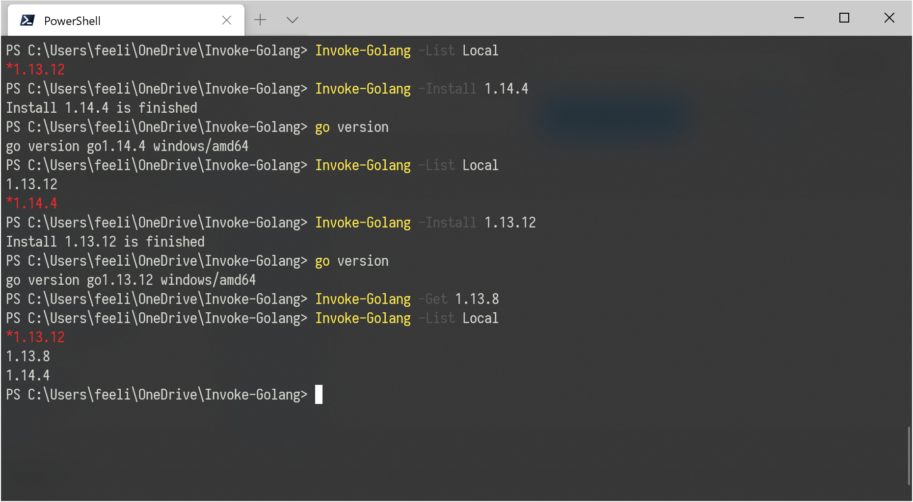

# Invoke-Golang ，针对 Windows 的 Golang 多版本管理工具



这是使用 PowerShell 编写的针对 Windows 平台的 Golang 多版本管理工具，具有指定版本下载、安装、卸载等功能，[与另外个 Golang 版本管理工具 g 高度兼容](https://github.com/voidint/g)。

## 更新记录

* 2020-07-17 修复新版本的下载链接无法获取的问题
* 2020-06-28 初始化版本

## 使用方法

```powershell
Import-Module .\Invoke-Golang.psm1

$Version = "1.14.4"

Invoke-Golang -List Remote
Invoke-Golang -Get $Version
Invoke-Golang -Install $Version
Invoke-Golang -List Local
Invoke-Golang -Remove $Version
```

## FAQ

如果在中国大陆地区，可能因为不可控的网络因素，需要指定到 Google CN 节点查询已经下载 Golang 的安装包，具体的配置如下：

```powershell
[System.Environment]::SetEnvironmentVariable("GOALNG_PACKAGE_URI", "https://golang.google.cn/dl/", "User")
```

`- eof -`
