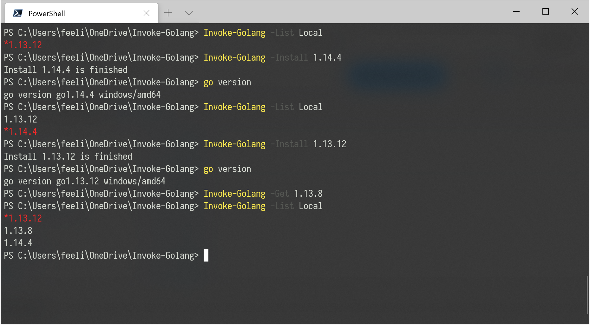

# Invoke-Golang ，针对 Windows 的 Golang 多版本管理工具



这是使用 PowerShell 编写的针对 Windows 平台的 Golang 多版本管理工具，具有指定版本下载、安装、卸载等功能，[与另外个 Golang 版本管理工具 g 高度兼容](https://github.com/voidint/g)。

<!-- TOC depthFrom:2 -->

- [更新记录](#更新记录)
- [使用方法](#使用方法)
- [开发与检查](#开发与检查)
- [FAQ](#faq)

<!-- /TOC -->

## 更新记录

- 2026-09-29 修复首次安装调用与版本号校验，改进本地版本查询和切换检查；新增模块清单、离线测试及 Windows GitHub Actions 检查
- 2020-07-17 修复新版本的下载链接无法获取的问题
- 2020-06-28 初始化版本

## 使用方法

在 Windows PowerShell 5.1 或 PowerShell 7 中运行，面向 Windows amd64。创建符号链接需要管理员权限，或启用 Windows 开发者模式。首次安装需要访问 Go 的下载站点。

```powershell
Import-Module .\Invoke-Golang.psd1

$Version = "1.14.4"

Invoke-Golang -List Remote
Invoke-Golang -Get $Version
Invoke-Golang -Install $Version
Invoke-Golang -List Local
Invoke-Golang -Remove $Version
```

`-Get` 会下载并解压版本到 `~/.g/versions`，但不会切换当前版本；`-Install` 会在需要时下载并切换 `~/.g/go` 符号链接。压缩包缓存位于 `~/.g/downloads`。安装会设置用户级 `GOROOT`，并将 `~/.g/go/bin` 加入用户级 `PATH`；首次加入用户级 `PATH` 时也会更新当前 PowerShell 会话。`-Remove` 会删除指定版本及其压缩包，请勿在使用该版本时删除。

## 开发与检查

模块清单为 `Invoke-Golang.psd1`，静态分析配置为 `PSScriptAnalyzerSettings.psd1`。在 PowerShell 中安装开发工具并运行离线检查：

```powershell
Install-Module Pester -MinimumVersion 5.0.0 -MaximumVersion 5.99.99 -Scope CurrentUser
Install-Module PSScriptAnalyzer -Scope CurrentUser
Invoke-ScriptAnalyzer -Path . -Recurse -Settings ./PSScriptAnalyzerSettings.psd1
Invoke-Pester -Path ./tests
```

GitHub Actions 在 Windows 上检查 PowerShell 语法、静态分析、模块导出和隔离的 Pester 测试。`Test.ps1` 是会联网并改动用户 Go 安装的手工集成脚本，不在 CI 中运行。

## FAQ

如果在中国大陆地区，可通过以下用户级环境变量指定 `-List Remote` 的版本列表页面（保留原有变量名 `GOALNG_PACKAGE_URI`）：

```powershell
[System.Environment]::SetEnvironmentVariable("GOALNG_PACKAGE_URI", "https://golang.google.cn/dl/", "User")
```

此设置只改变远程列表的查询地址；实际下载仍使用 `https://dl.google.com/go/`，无法访问时安装也会失败。

`- eof -`
